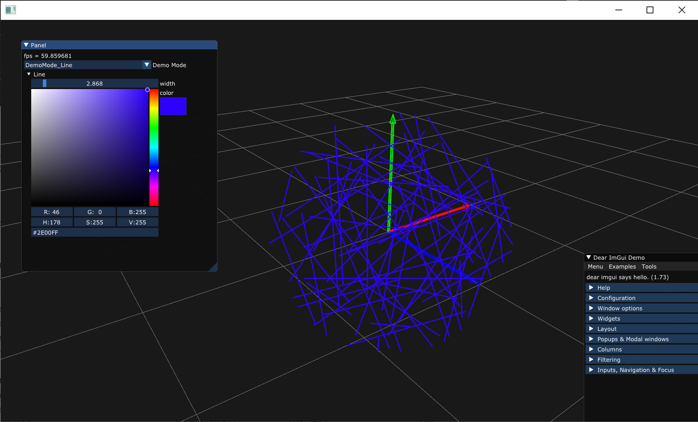
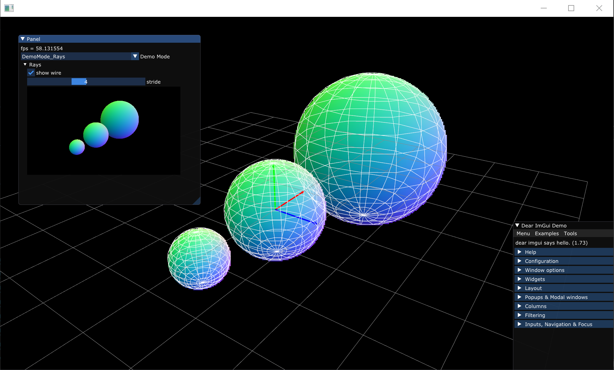
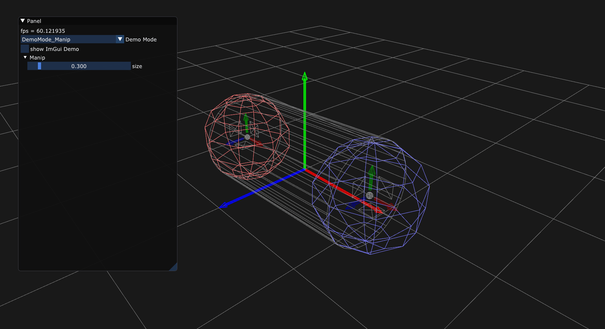

## prlib, Simple Prototype Environment

```

premake5 vs2017

```

## create project

```

curl "https://raw.githubusercontent.com/Ushio/prlib/master/example_as_submodule/create_project.bat" -O create_project.bat & create_project

```

## demo



